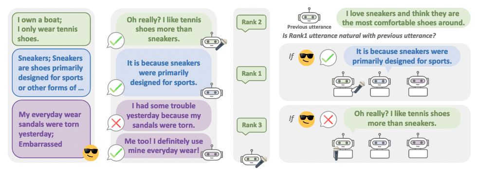

# BotsTalk: Machine-Sourced Framework for Automatic Curation of Large-scale Multi-skill Dialogue Datasets



**Official Pytorch implementation of our EMNLP paper:**<br>
[Minju Kim*](https://min942773.github.io/), [Chaehyeong Kim*](https://cheris8.github.io/home/), [Yongho Song*](https://kopf-yhs.github.io/), [Seung-won Hwang](https://seungwonh.github.io/) and [Jinyoung Yeo](http://convei.weebly.com/). BotsTalk: Machine-Sourced Framework for Automatic Curation of Large-scale Multi-skill Dialogue Datasets. _EMNLP_, 2022 [[Paper]](https://arxiv.org/abs/2210.12687) (* equal contribution)


## Reference

If you use the materials in this repository as part of any published research, we ask you to cite the following [paper](https://arxiv.org/abs/0000):

```bibtex
@inproceedings{Kim2022botstalk,
  title={BotsTalk: Machine-Sourced Framework for Automatic Curation of Large-scale Multi-skill Dialogue Datasets},
  author={Kim, Minju and Kim, Chaehyeong and Song, Yongho, Seung-won Hwang and Yeo, Jinyoung},
  booktitle={EMNLP},
  year=2022
}
```

## BSBT dataset
You can download the paper version of our BSBT dataset [here](https://drive.google.com/file/d/1ZR8yKnSSXpPU4Pnw7vGqpEapVODWaqyJ/view?usp=sharing).


## Running Experiments

### Building BSBT dataset

```bash
python scripts/self_mix.py \
--subtasks convai2,wizard_of_wikipedia,empatheticdialogues \
--num-self-mixs 5 \
--selfmix-max-turns 6 \
--datatype train \
--expert-model-files zoo:dodecadialogue/convai2_ft/model,zoo:dodecadialogue/wizard_of_wikipedia_ft/model,zoo:dodecadialogue/empathetic_dialogues_ft/model \
--expert-model-opt-files opt_files/conv.opt,opt_files/wow.opt,opt_files/ed.opt \
--display-examples True \
--task convai2 --seed_messages_from_task 1 \
--model-file zoo:dodecadialogue/convai2_ft/model \
--skip-generation False --inference nucleus \
--beam-size 3 \
--beam-min-length 10 --beam-block-ngram 3 --beam-context-block-ngram 3 \
--save-format parlai \
--ranker-model-files zoo:pretrained_transformers/model_poly/model,/home/minju/empathetic_dialogues_poly/model.checkpoint,/your_path/wizard_of_wikipedia_poly/model.checkpoint \
--outfile your_path/output/test_files.txt
```

## Have any question?
Please contact [Minju Kim](https://min942773.github.io/) at minnju@yonsei.ac.kr.

## License

This repository is MIT licensed. See the [LICENSE](https://github.com/min942773/BotsTalk/blob/main/LICENSE) file for details.
